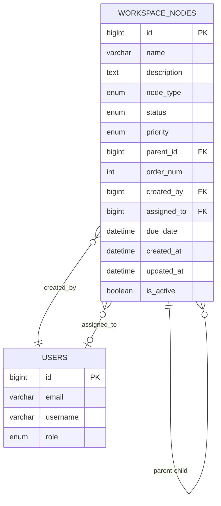

# 업무 관리 시스템 - 1차 구현 계획서 (수정)

## 개요

**사이드바 트리 구조 중심**의 업무 관리 시스템을 구현합니다.

**핵심포인트**:
- **좌측 사이드바**: 계층 구조 트리 (개발자 → 태스크 → 문서)
- **우측 메인 영역**: 선택된 항목의 상세 정보 표시
- **드래그앤드롭**: 트리 항목 이동 및 재정렬

**아키텍처**:
- Backend: DDD (Domain-Driven Design)
- Frontend: FSD (Feature-Sliced Design)

---

## 1. UI 구조

```
┌─────────────────────────────────────────────────────────┐
│ 헤더: 업무 관리                                            │
├──────────────────┬──────────────────────────────────────┤
│ 사이드바 (트리)   │ 메인 콘텐츠 영역                        │
│                  │                                      │
│ 📁 개발자1        │  [선택된 항목의 상세 정보]              │
│   📋 태스크1      │                                      │
│     📄 문서1      │  - 제목                              │
│     📄 문서2      │  - 설명                              │
│   📋 태스크2      │  - 메타데이터                         │
│ 📁 개발자2        │  - 상태/우선순위                      │
│   📋 태스크3      │                                      │
│     📄 문서3      │  [수정] [삭제]                        │
│                  │                                      │
│ [+ 폴더] [+ 항목] │                                      │
└──────────────────┴──────────────────────────────────────┘
```

---

## 2. 데이터 모델 설계

### 2.1 핵심 개념

1. **WorkspaceNode (작업공간 노드)**: 모든 항목의 기본 단위
   - 타입: `FOLDER`, `TASK`, `DOCUMENT`
   - 계층 구조: `parent_id`로 부모-자식 관계
   - 순서: `order_num`으로 같은 레벨 내 정렬

2. **계층 구조**:
   ```
   ROOT
   ├── FOLDER (개발자1)
   │   ├── TASK (태스크1)
   │   │   ├── DOCUMENT (문서1)
   │   │   └── DOCUMENT (문서2)
   │   └── TASK (태스크2)
   └── FOLDER (개발자2)
       └── TASK (태스크3)
   ```

### 2.2 ERD



### 2.3 테이블 생성 SQL

```sql
-- 작업공간 노드 테이블
CREATE TABLE workspace_nodes (
    id BIGINT AUTO_INCREMENT PRIMARY KEY COMMENT '노드 ID',
    name VARCHAR(255) NOT NULL COMMENT '노드 이름',
    description TEXT COMMENT '설명',
    node_type ENUM('FOLDER', 'TASK', 'DOCUMENT') NOT NULL COMMENT '노드 타입',
    status ENUM('TODO', 'IN_PROGRESS', 'DONE', 'BLOCKED') 
        DEFAULT 'TODO' COMMENT '상태 (TASK/DOCUMENT만)',
    priority ENUM('LOW', 'MEDIUM', 'HIGH', 'URGENT') 
        DEFAULT 'MEDIUM' COMMENT '우선순위 (TASK만)',
    parent_id BIGINT COMMENT '부모 노드 ID',
    order_num INT NOT NULL DEFAULT 0 COMMENT '정렬 순서',
    created_by BIGINT NOT NULL COMMENT '생성자 ID',
    assigned_to BIGINT COMMENT '담당자 ID (TASK만)',
    due_date DATETIME COMMENT '마감일 (TASK만)',
    created_at DATETIME DEFAULT CURRENT_TIMESTAMP,
    updated_at DATETIME DEFAULT CURRENT_TIMESTAMP ON UPDATE CURRENT_TIMESTAMP,
    is_active BOOLEAN DEFAULT TRUE,

    FOREIGN KEY (parent_id) REFERENCES workspace_nodes(id) ON DELETE CASCADE,
    FOREIGN KEY (created_by) REFERENCES users(id) ON DELETE CASCADE,
    FOREIGN KEY (assigned_to) REFERENCES users(id) ON DELETE SET NULL,

    INDEX idx_parent_id (parent_id),
    INDEX idx_node_type (node_type),
    INDEX idx_status (status),
    INDEX idx_order_num (order_num)
) ENGINE=InnoDB DEFAULT CHARSET=utf8mb4 COLLATE=utf8mb4_unicode_ci;
```

---

## 3. Backend 구현 (DDD)

### 3.1 디렉터리 구조

```
parantier-api/src/main/java/com/mapo/palantier/workspace/
├── application/
│   └── WorkspaceService.java           # 비즈니스 로직
├── domain/
│   ├── WorkspaceNode.java              # 도메인 엔티티
│   ├── NodeType.java                   # 노드 타입 Enum
│   ├── NodeStatus.java                 # 상태 Enum
│   ├── NodePriority.java               # 우선순위 Enum
│   └── WorkspaceRepository.java        # 저장소 인터페이스
├── infrastructure/
│   ├── WorkspaceRepositoryImpl.java    # 저장소 구현
│   └── WorkspaceMapper.java            # MyBatis 매퍼
└── presentation/
    ├── WorkspaceController.java        # REST API
    └── dto/
        ├── CreateNodeRequest.java
        ├── UpdateNodeRequest.java
        ├── MoveNodeRequest.java
        └── WorkspaceTreeResponse.java
```

### 3.2 도메인 클래스

#### NodeType.java (Enum)
```java
public enum NodeType {
    FOLDER,      // 폴더 (개발자, 그룹 등)
    TASK,        // 태스크 (업무)
    DOCUMENT     // 문서
}
```

#### NodeStatus.java (Enum)
```java
public enum NodeStatus {
    TODO,           // 대기
    IN_PROGRESS,    // 진행중
    DONE,           // 완료
    BLOCKED         // 차단
}
```

#### NodePriority.java (Enum)
```java
public enum NodePriority {
    LOW,       // 낮음
    MEDIUM,    // 보통
    HIGH,      // 높음
    URGENT     // 긴급
}
```

### 3.3 API 엔드포인트

| Method | URL | 설명 |
|--------|-----|------|
| GET | `/api/workspace/tree` | 전체 트리 구조 조회 |
| GET | `/api/workspace/nodes/{id}` | 특정 노드 상세 조회 |
| GET | `/api/workspace/nodes/{id}/children` | 자식 노드 목록 조회 |
| POST | `/api/workspace/nodes` | 노드 생성 |
| PUT | `/api/workspace/nodes/{id}` | 노드 수정 |
| PUT | `/api/workspace/nodes/{id}/move` | 노드 이동 (parent_id, order_num 변경) |
| DELETE | `/api/workspace/nodes/{id}` | 노드 삭제 (자식도 함께) |
| GET | `/api/workspace/nodes/search?q={query}` | 노드 검색 |

---

## 4. Frontend 구현 (FSD)

### 4.1 디렉터리 구조

```
parantier-front/src/
├── entities/workspace/
│   ├── api/workspaceApi.ts           # API 호출
│   └── model/types.ts                # 타입 정의
├── features/workspace/
│   ├── hooks/
│   │   ├── useWorkspaceTree.ts       # 트리 데이터
│   │   └── useNodeMutation.ts        # CRUD 뮤테이션
│   └── components/
│       └── TreeNode.tsx              # 재귀 트리 노드 컴포넌트
├── pages/admin/workspace/
│   ├── WorkspacePage.tsx             # 메인 페이지
│   └── components/
│       ├── Sidebar.tsx               # 좌측 트리 사이드바
│       ├── NodeDetail.tsx            # 우측 상세 정보
│       └── NodeForm.tsx              # 노드 생성/수정 폼
└── shared/ui/
    └── (공통 컴포넌트 재사용)
```

### 4.2 타입 정의

```typescript
// NodeType Enum
export enum NodeType {
  FOLDER = 'FOLDER',
  TASK = 'TASK',
  DOCUMENT = 'DOCUMENT',
}

// NodeStatus Enum
export enum NodeStatus {
  TODO = 'TODO',
  IN_PROGRESS = 'IN_PROGRESS',
  DONE = 'DONE',
  BLOCKED = 'BLOCKED',
}

// NodePriority Enum
export enum NodePriority {
  LOW = 'LOW',
  MEDIUM = 'MEDIUM',
  HIGH = 'HIGH',
  URGENT = 'URGENT',
}

// WorkspaceNode 인터페이스
export interface WorkspaceNode {
  id: number
  name: string
  description?: string
  nodeType: NodeType
  status?: NodeStatus
  priority?: NodePriority
  parentId?: number
  orderNum: number
  createdBy: number
  assignedTo?: number
  dueDate?: string
  createdAt: string
  updatedAt: string
  
  // 프론트엔드 전용
  children?: WorkspaceNode[]
  isExpanded?: boolean
  assignedToUsername?: string
  createdByUsername?: string
}
```

### 4.3 주요 라이브러리

**드래그앤드롭**: `@dnd-kit/core`, `@dnd-kit/sortable`
- 트리 항목 드래그로 이동
- 같은 레벨 내 순서 변경
- 다른 폴더로 이동

**트리 UI**: 직접 구현 (재귀 컴포넌트)
- `TreeNode` 컴포넌트를 재귀로 렌더링
- 확장/축소 상태 관리
- 아이콘: `lucide-react` (`ChevronRight`, `Folder`, `FileText`, `CheckSquare`)

---

## 5. 구현 순서

### 단계 1: Backend 기본 CRUD (1일)

**세부 작업**:
- [ ] `workspace_nodes` 테이블 생성
- [ ] `WorkspaceNode` 도메인 생성
- [ ] `NodeType`, `NodeStatus`, `NodePriority` Enum 생성
- [ ] `WorkspaceRepository` 인터페이스 생성
- [ ] `WorkspaceMapper.xml` 생성 (MyBatis)
  - 트리 조회 쿼리 (재귀 CTE)
  - 자식 노드 조회
  - CRUD 쿼리
- [ ] `WorkspaceRepositoryImpl` 구현
- [ ] `WorkspaceService` 비즈니스 로직
  - 트리 구조 빌드
  - 노드 이동 로직
  - 순서 재정렬
- [ ] `WorkspaceController` REST API
- [ ] DTO 생성

**검증**:
- Postman으로 API 테스트
- 트리 구조 정상 조회 확인
- 노드 이동/순서 변경 확인

---

### 단계 2: Frontend 트리 UI (1.5일)

**세부 작업**:
- [ ] `types.ts` 타입 정의
- [ ] `workspaceApi.ts` API 함수
- [ ] `useWorkspaceTree.ts` 훅 (TanStack Query)
- [ ] `WorkspacePage.tsx` 레이아웃
  - 2-column 레이아웃 (Sidebar + Detail)
- [ ] `Sidebar.tsx` 트리 사이드바
  - 재귀 트리 렌더링
  - 확장/축소 상태
  - 노드 선택 이벤트
- [ ] `TreeNode.tsx` 재귀 노드 컴포넌트
  - 노드 타입별 아이콘
  - 들여쓰기 표시
  - 클릭 이벤트
- [ ] `NodeDetail.tsx` 상세 정보 표시
  - 선택된 노드 정보
  - 타입별 다른 정보 표시
- [ ] `NodeForm.tsx` 생성/수정 폼
  - 다이얼로그 또는 모달
  - 타입 선택
  - 부모 노드 선택

**검증**:
- 트리 구조 정상 렌더링
- 확장/축소 동작 확인
- 노드 선택 → 상세 정보 표시
- CRUD 동작 확인

---

### 단계 3: 드래그앤드롭 (1일)

**세부 작업**:
- [ ] `@dnd-kit` 패키지 설치
- [ ] `DndContext` 설정
- [ ] `TreeNode`에 드래그 기능 추가
  - `useDraggable`, `useDroppable` 훅
  - 드래그 중 시각적 피드백
- [ ] 드롭 처리 로직
  - 같은 레벨 내 순서 변경
  - 다른 폴더로 이동
  - 유효성 검증 (폴더는 문서 아래 불가 등)
- [ ] API 연동 (`/move` 엔드포인트)
- [ ] Optimistic Update
  - 드래그 즉시 UI 업데이트
  - API 실패 시 롤백

**검증**:
- 드래그로 순서 변경 확인
- 폴더 이동 확인
- 유효성 검증 확인
- 롤백 동작 확인

---

### 단계 4: 메뉴 연동 및 마무리 (0.5일)

**세부 작업**:
- [ ] `menus` 테이블에 "업무 관리" 메뉴 추가
  ```sql
  INSERT INTO menus (name, path, parent_id, menu_type, order_num, required_role, is_active)
  VALUES ('업무 관리', '/admin/workspace', NULL, 'HEADER', 3, 'ROLE_USER', TRUE);
  ```
- [ ] `routes.tsx`에 라우트 추가
- [ ] 권한 검증 (ROLE_USER 이상)
- [ ] 검색 기능 추가 (선택사항)
- [ ] 로딩/에러 처리
- [ ] Toast 메시지

**검증**:
- 헤더 메뉴 표시 확인
- 권한 체크 확인
- 전체 플로우 테스트

---

## 6. 완료 기준 (Definition of Done)

- [ ] Backend API 모든 엔드포인트 정상 동작
- [ ] 트리 구조 정상 렌더링 (재귀)
- [ ] 노드 CRUD 기능 구현
- [ ] 드래그앤드롭으로 노드 이동/순서 변경
- [ ] 노드 선택 시 상세 정보 표시
- [ ] 타입별 아이콘 표시 (📁📋📄)
- [ ] 헤더 메뉴 연동
- [ ] Toast 메시지 정상 동작
- [ ] 에러 처리 완료
- [ ] Optimistic Update 동작

---

## 7. 향후 계획

### 2차 구현: 본문 콘텐츠 편집 (2일)
- 마크다운 에디터 통합 (`@toast-ui/react-editor`)
- 문서 버전 관리
- 문서 내 이미지 업로드
- 코드 블록 syntax highlighting
- 문서 미리보기

### 3차 구현: 부가 기능 (2일)
- **실시간 협업**: WebSocket + Redis
  - 다른 사용자의 편집 실시간 반영
  - 온라인 사용자 표시
- **음성 인식**: Web Speech API
  - 음성으로 태스크 생성
- **MCP 연동**: Claude AI 어시스턴트
  - 업무 자동 분류
  - 우선순위 추천
- **알림 센터**: 
  - 태스크 할당 알림
  - 마감일 임박 알림

---

## 8. 참고 구현

- 메뉴 관리 트리 구조 (`parantier-front/src/pages/admin/menus/`)
- DDD 구조 (`parantier-api/src/main/java/com/mapo/palantier/menu/`)
- MyBatis 재귀 쿼리 참고

---

**생성일**: 2026-03-23
**생성자**: Claude + 사용자
**프로젝트**: Palantier (마포 팔란티어)
**목적**: 업무 관리 시스템 1차 구현 계획서 (사이드바 트리 중심)
**총 예상 기간**: 4일 (Backend 1일 + Frontend 트리 1.5일 + 드래그앤드롭 1일 + 마무리 0.5일)
