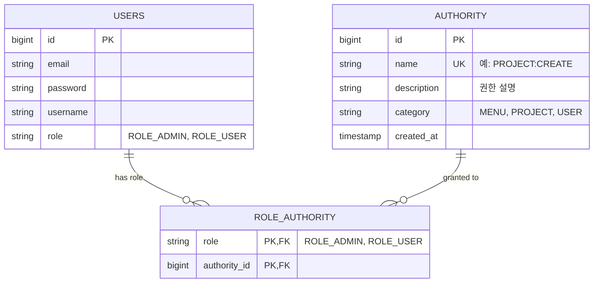
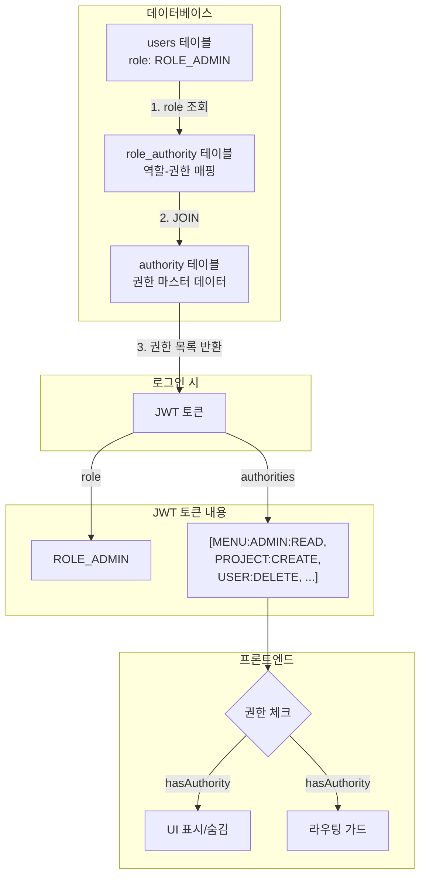

# 권한 관리 테이블 관계도

## ERD (Entity Relationship Diagram)



## 테이블 설명

### 1. users (사용자 테이블)
- 사용자의 **기본 역할** 하나만 저장
- `role` 컬럼: `ROLE_ADMIN`, `ROLE_USER` 등

### 2. authority (권한 마스터 테이블)
- 시스템의 **모든 권한** 정의
- 예시:
  - `MENU:ADMIN:READ` - 관리자 메뉴 읽기
  - `PROJECT:CREATE` - 프로젝트 생성
  - `USER:DELETE` - 사용자 삭제

### 3. role_authority (역할-권한 매핑 테이블)
- **어떤 역할이 어떤 권한을 가지는지** 매핑
- N:M 관계를 표현하는 중간 테이블

## 데이터 예시

### authority 테이블
| id | name | description | category |
|----|------|-------------|----------|
| 1 | MENU:DASHBOARD:READ | 대시보드 메뉴 읽기 | MENU |
| 2 | MENU:ADMIN:READ | 관리자 메뉴 읽기 | MENU |
| 3 | PROJECT:CREATE | 프로젝트 생성 | PROJECT |
| 4 | PROJECT:DELETE | 프로젝트 삭제 | PROJECT |
| 5 | USER:DELETE | 사용자 삭제 | USER |

### role_authority 테이블
| role | authority_id | (권한 이름) |
|------|--------------|-------------|
| ROLE_ADMIN | 1 | MENU:DASHBOARD:READ |
| ROLE_ADMIN | 2 | MENU:ADMIN:READ |
| ROLE_ADMIN | 3 | PROJECT:CREATE |
| ROLE_ADMIN | 4 | PROJECT:DELETE |
| ROLE_ADMIN | 5 | USER:DELETE |
| ROLE_USER | 1 | MENU:DASHBOARD:READ |
| ROLE_USER | 3 | PROJECT:CREATE |

### users 테이블
| id | email | role |
|----|-------|------|
| 1 | admin@example.com | ROLE_ADMIN |
| 2 | user@example.com | ROLE_USER |

## 조회 흐름

### 1. 사용자 로그인 시
```sql
-- 1. users 테이블에서 사용자 정보 조회
SELECT * FROM users WHERE email = 'admin@example.com';
-- 결과: role = 'ROLE_ADMIN'

-- 2. role_authority + authority 조인으로 권한 목록 조회
SELECT a.name
FROM authority a
INNER JOIN role_authority ra ON a.id = ra.authority_id
WHERE ra.role = 'ROLE_ADMIN';
-- 결과: ['MENU:DASHBOARD:READ', 'MENU:ADMIN:READ', 'PROJECT:CREATE', 'PROJECT:DELETE', 'USER:DELETE']

-- 3. JWT 토큰 생성 시 권한 배열 포함
{
  "role": "ROLE_ADMIN",
  "authorities": [
    "MENU:DASHBOARD:READ",
    "MENU:ADMIN:READ",
    "PROJECT:CREATE",
    "PROJECT:DELETE",
    "USER:DELETE"
  ]
}
```

### 2. 프론트엔드에서 권한 체크
```typescript
// JWT에서 추출한 authorities 배열로 체크
const canDeleteUser = user.authorities.includes('USER:DELETE')
const canCreateProject = user.authorities.includes('PROJECT:CREATE')
```

## 관계 정리



## 핵심 포인트

1. **users.role**: 사용자의 기본 역할 (1개만 저장)
2. **authority**: 시스템의 모든 권한 정의
3. **role_authority**: 역할과 권한의 N:M 관계
4. **JWT**: 로그인 시 조회한 권한 배열을 포함
5. **프론트**: JWT에서 추출한 authorities로 실시간 체크

## 장점

- ✅ **역할 추가**: `role_authority`에만 데이터 추가
- ✅ **권한 추가**: `authority`에 추가 후 `role_authority`에 매핑
- ✅ **유연한 권한 부여**: 같은 역할이라도 다른 권한 조합 가능
- ✅ **확장성**: 사용자별 추가 권한도 구현 가능 (user_authority 테이블)
